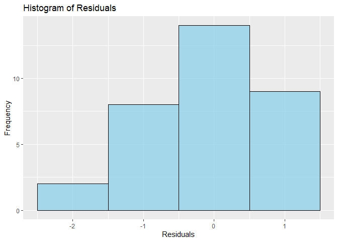

Activity 2
================

### A typical modeling process

The process that we will use for today’s activity is:

1.  Identify our research question(s),
2.  Explore (graphically and with numerical summaries) the variables of
    interest - both individually and in relationship to one another,
3.  Fit a simple linear regression model to obtain and describe model
    estimates,
4.  Assess how “good” our model is, and
5.  Predict new values.

We will continue to update/tweak/adapt this process and you are
encouraged to build your own process. Before we begin, we set up our R
session and introduce this activity’s data.

## Day 1

### The setup

We will be using two packages from Posit (formerly
[RStudio](https://posit.co/)): `{tidyverse}` and `{tidymodels}`. If you
would like to try the *ISLR* labs using these two packages instead of
base R, [Emil Hvitfeldt](https://www.emilhvitfeldt.com/) (of Posit) has
put together a [complementary online
text](https://emilhvitfeldt.github.io/ISLR-tidymodels-labs/index.html).

- In the **Packages** pane of RStudio (same area as **Files**), check to
  see if `{tidyverse}` and `{tidymodels}` are installed. Be sure to
  check both your **User Library** and **System Library**.

- If either of these are not currently listed, type the following in
  your **Console** pane, replacing `package_name` with the appropriate
  name, and press Enter/Return afterwards.

  ``` r
  # Note: the "eval = FALSE" in the above line tells R not to evaluate this code
  install.packages("package_name")
  ```

- Once you have verified that both `{tidyverse}` and `{tidymodels}` are
  installed, load these packages in the R chunk below titled `setup`.
  That is, type the following:

  ``` r
  library(tidyverse)
  library(tidymodels)
  ```

- Run the `setup` code chunk and/or **knit**
   icon
  your Rmd document to verify that no errors occur.

``` r
library(tidyverse)
```

    ## Warning: package 'tidyverse' was built under R version 4.3.2

    ## Warning: package 'ggplot2' was built under R version 4.3.2

    ## Warning: package 'readr' was built under R version 4.3.2

    ## Warning: package 'stringr' was built under R version 4.3.2

    ## ── Attaching core tidyverse packages ──────────────────────── tidyverse 2.0.0 ──
    ## ✔ dplyr     1.1.3     ✔ readr     2.1.5
    ## ✔ forcats   1.0.0     ✔ stringr   1.5.1
    ## ✔ ggplot2   3.4.4     ✔ tibble    3.2.1
    ## ✔ lubridate 1.9.3     ✔ tidyr     1.3.0
    ## ✔ purrr     1.0.2     
    ## ── Conflicts ────────────────────────────────────────── tidyverse_conflicts() ──
    ## ✖ dplyr::filter() masks stats::filter()
    ## ✖ dplyr::lag()    masks stats::lag()
    ## ℹ Use the conflicted package (<http://conflicted.r-lib.org/>) to force all conflicts to become errors

``` r
library(tidymodels)
```

    ## Warning: package 'tidymodels' was built under R version 4.3.2

    ## ── Attaching packages ────────────────────────────────────── tidymodels 1.1.1 ──
    ## ✔ broom        1.0.5     ✔ rsample      1.2.0
    ## ✔ dials        1.2.0     ✔ tune         1.1.2
    ## ✔ infer        1.0.5     ✔ workflows    1.1.3
    ## ✔ modeldata    1.3.0     ✔ workflowsets 1.0.1
    ## ✔ parsnip      1.1.1     ✔ yardstick    1.3.0
    ## ✔ recipes      1.0.9

    ## Warning: package 'dials' was built under R version 4.3.2

    ## Warning: package 'infer' was built under R version 4.3.2

    ## Warning: package 'modeldata' was built under R version 4.3.2

    ## Warning: package 'parsnip' was built under R version 4.3.2

    ## Warning: package 'recipes' was built under R version 4.3.2

    ## Warning: package 'rsample' was built under R version 4.3.2

    ## Warning: package 'tune' was built under R version 4.3.2

    ## Warning: package 'workflows' was built under R version 4.3.2

    ## Warning: package 'workflowsets' was built under R version 4.3.2

    ## Warning: package 'yardstick' was built under R version 4.3.2

    ## ── Conflicts ───────────────────────────────────────── tidymodels_conflicts() ──
    ## ✖ scales::discard() masks purrr::discard()
    ## ✖ dplyr::filter()   masks stats::filter()
    ## ✖ recipes::fixed()  masks stringr::fixed()
    ## ✖ dplyr::lag()      masks stats::lag()
    ## ✖ yardstick::spec() masks readr::spec()
    ## ✖ recipes::step()   masks stats::step()
    ## • Use suppressPackageStartupMessages() to eliminate package startup messages

 **Check in**

Test your GitHub skills by staging, committing, and pushing your changes
to GitHub and verify that your changes have been added to your GitHub
repository.

### The data

The data we’re working with is from the OpenIntro site:
`https://www.openintro.org/data/csv/hfi.csv`. Here is the “about” page:
<https://www.openintro.org/data/index.php?data=hfi>.

In the R code chunk below titled `load-data`, you will type the code
that reads in the above linked CSV file by doing the following:

``` r
# Load data from the provided URL
hfi <- readr::read_csv("https://www.openintro.org/data/csv/hfi.csv")
```

    ## Rows: 1458 Columns: 123
    ## ── Column specification ────────────────────────────────────────────────────────
    ## Delimiter: ","
    ## chr   (3): ISO_code, countries, region
    ## dbl (120): year, pf_rol_procedural, pf_rol_civil, pf_rol_criminal, pf_rol, p...
    ## 
    ## ℹ Use `spec()` to retrieve the full column specification for this data.
    ## ℹ Specify the column types or set `show_col_types = FALSE` to quiet this message.

- Rather than downloading this file, uploading to RStudio, then reading
  it in, explore how to load this file directly from the provided URL
  with `readr::read_csv` (`{readr}` is part of `{tidyverse}`).
- Assign this data set into a data frame named `hfi` (short for “Human
  Freedom Index”).

After doing this and viewing the loaded data, answer the following
questions:

1.  What are the dimensions of the dataset? What does each row
    represent?

The dataset spans a lot of years. We are only interested in data from
year 2016. In the R code chunk below titled `hfi-2016`, type the code
that does the following:

- Filter the data `hfi` data frame for year 2016, and
- Assigns the result to a data frame named `hfi_2016`.

``` r
hfi_2016 <- hfi %>%
  filter(year == 2016)
```

### 1. Identify our research question(s)

The research question is often defined by you (or your company, boss,
etc.). Today’s research question/goal is to predict a country’s personal
freedom score in 2016.

For this activity we want to explore the relationship between the
personal freedom score, `pf_score`, and the political pressures and
controls on media content index,`pf_expression_control`. Specifically,
we are going to use the political pressures and controls on media
content index to predict a country’s personal freedom score in 2016.

### 2. Explore the variables of interest

Answer the following questions (use your markdown skills) and complete
the following tasks.

2.  What type of plot would you use to display the distribution of the
    personal freedom scores, `pf_score`? Would this be the same type of
    plot to display the distribution of the political pressures and
    controls on media content index, `pf_expression_control`?

**I would use a histogram to display the distribution of both plots.**

- In the R code chunk below titled `univariable-plots`, type the R code
  that displays this plot for `pf_score`.
- In the R code chunk below titled `univariable-plots`, type the R code
  that displays this plot for `pf_expression_control`.

``` r
# Displaying distribution plot for pf_score
ggplot(hfi_2016, aes(x = pf_score)) +
  geom_histogram(binwidth = 1, fill = "skyblue", color = "black", alpha = 0.7) +
  labs(title = "Distribution of Personal Freedom Scores (pf_score)",
       x = "Personal Freedom Score",
       y = "Frequency")
```

<!-- -->

``` r
# Displaying distribution plot for pf_expression_control
ggplot(hfi_2016, aes(x = pf_expression_control)) +
  geom_histogram(binwidth = 1, fill = "lightgreen", color = "black", alpha = 0.7) +
  labs(title = "Distribution of Political Pressures and Controls on Media Content Index (pf_expression_control)",
       x = "Political Pressures and Controls on Media Content Index",
       y = "Frequency")
```

<!-- -->

4.  Comment on each of these two distributions. Be sure to describe
    their centers, spread, shape, and any potential outliers.

**Both distributions are unimodal (slightly skewed to the left).**

5.  What type of plot would you use to display the relationship between
    the personal freedom score, `pf_score`, and the political pressures
    and controls on media content index,`pf_expression_control`?

**I’d use a ggplot to display the relationship between the two
distributions.**

- In the R code chunk below titled `relationship-plot`, plot this
  relationship using the variable `pf_expression_control` as the
  predictor/explanatory variable.

``` r
# Relationship plot between pf_score and pf_expression_control
ggplot(hfi_2016, aes(x = pf_expression_control, y = pf_score)) +
  geom_point(color = "darkorange", alpha = 0.7) +
  labs(title = "Relationship between Personal Freedom Score (pf_score) and\nPolitical Pressures and Controls on Media Content Index (pf_expression_control)",
       x = "Political Pressures and Controls on Media Content Index",
       y = "Personal Freedom Score")
```

<!-- -->

4.  Does the relationship look linear? If you knew a country’s
    `pf_expression_control`, or its score out of 10, with 0 being the
    most, of political pressures and controls on media content, would
    you be comfortable using a linear model to predict the personal
    freedom score?

\*\*The relationship appears to be linear. Based on the plot, I’d be
comfortable using a linear model to predict the personal freedom score

#### Challenge

For each plot and using your `{dplyr}` skills, obtain the appropriate
numerical summary statistics and provide more detailed descriptions of
these plots. For example, in (4) you were asked to comment on the
center, spread, shape, and potential outliers. What measures
could/should be used to describe these?

**For each plot and the relationship between the variables, measures
such as the mean, median, standard deviation, minimum, and maximum can
be used to describe the center, spread, and potential outliers of the
distribution.**

**The correlation coefficient provides a numerical summary of the
relationship between two numerical variables in the case of a scatter
plot.**

You might not know of one for each of those terms.

What numerical summary would you use to describe the relationship
between two numerical variables? (hint: explore the `cor` function from
Base R)

``` r
# Summary statistics for pf_score
summary_pf_score <- hfi_2016 %>%
  summarize(
    mean_pf_score = mean(pf_score),
    median_pf_score = median(pf_score),
    sd_pf_score = sd(pf_score),
    min_pf_score = min(pf_score),
    max_pf_score = max(pf_score)
  )

summary_pf_score
```

    ## # A tibble: 1 × 5
    ##   mean_pf_score median_pf_score sd_pf_score min_pf_score max_pf_score
    ##           <dbl>           <dbl>       <dbl>        <dbl>        <dbl>
    ## 1          6.98            6.93        1.49         2.17         9.40

``` r
# Summary statistics for pf_expression_control
summary_pf_expression_control <- hfi_2016 %>%
  summarize(
    mean_pf_expression_control = mean(pf_expression_control),
    median_pf_expression_control = median(pf_expression_control),
    sd_pf_expression_control = sd(pf_expression_control),
    min_pf_expression_control = min(pf_expression_control),
    max_pf_expression_control = max(pf_expression_control)
  )

summary_pf_expression_control
```

    ## # A tibble: 1 × 5
    ##   mean_pf_expression_control median_pf_expression_control sd_pf_expression_con…¹
    ##                        <dbl>                        <dbl>                  <dbl>
    ## 1                       4.98                            5                   2.32
    ## # ℹ abbreviated name: ¹​sd_pf_expression_control
    ## # ℹ 2 more variables: min_pf_expression_control <dbl>,
    ## #   max_pf_expression_control <dbl>

``` r
# Correlation between pf_score and pf_expression_control
correlation <- cor(hfi_2016$pf_score, hfi_2016$pf_expression_control)
correlation
```

    ## [1] 0.8450646

### 3. Fit a simple linear regression model

Regardless of your response to (4), we will continue fitting a simple
linear regression (SLR) model to these data. The code that we will be
using to fit statistical models in this course use `{tidymodels}` - an
opinionated way to fit models in R - and this is likely new to most of
you. I will provide you with example code when I do not think you should
know what to do - i.e., anything `{tidymodels}` related.

To begin, we will create a `{parsnip}` specification for a linear model.

- In the code chunk below titled `parsnip-spec`, replace “verbatim” with
  “r” just before the code chunk title.

``` r
lm_spec <- linear_reg() %>%
  set_mode("regression") %>%
  set_engine("lm")

lm_spec
```

    ## Linear Regression Model Specification (regression)
    ## 
    ## Computational engine: lm

Note that the `set_mode("regression")` is really unnecessary/redundant
as linear models (`"lm"`) can only be regression models. It is better to
be explicit as we get comfortable with this new process. Remember that
you can type `?function_name` in the R **Console** to explore a
function’s help documentation.

The above code also outputs the `lm_spec` output. This code does not do
any calculations by itself, but rather specifies what we plan to do.

Using this specification, we can now fit our model:
$\texttt{pf\score} = \beta_0 + \beta_1 \times \texttt{pf\_expression\_control} + \varepsilon$.
Note, the “\$” portion in the previous sentence is LaTeX snytex which is
a math scripting (and other scripting) language. I do not expect you to
know this, but you will become more comfortable with this. Look at your
knitted document to see how this syntax appears.

- In the code chunk below titled `fit-lm`, replace “verbatim” with “r”
  just before the code chunk title.

``` r
slr_mod <- lm_spec %>% 
  fit(pf_score ~ pf_expression_control, data = hfi_2016)

tidy(slr_mod)
```

    ## # A tibble: 2 × 5
    ##   term                  estimate std.error statistic  p.value
    ##   <chr>                    <dbl>     <dbl>     <dbl>    <dbl>
    ## 1 (Intercept)              4.28     0.149       28.8 4.23e-65
    ## 2 pf_expression_control    0.542    0.0271      20.0 2.31e-45

The above code fits our SLR model, then provides a `tidy` parameter
estimates table.

5.  Using the `tidy` output, update the below formula with the estimated
    parameters. That is, replace “intercept” and “slope” with the
    appropriate values

$\hat{\texttt{pf\score}} = intercept + slope \times \texttt{pf\_expression\_control}$

``` r
# Assuming model is the object resulting from your linear regression
model <- lm(pf_score ~ pf_expression_control, data = hfi_2016)
tidy_output <- tidy(model)

# Extracting intercept and slope
estimate_intercept <- tidy_output %>%
  filter(term == "(Intercept)") %>%
  pull(estimate)

estimate_slope <- tidy_output %>%
  filter(term == "pf_expression_control") %>%
  pull(estimate)

# Updated formula
updated_formula <- glue::glue("pf_score = {estimate_intercept} + {estimate_slope} * pf_expression_control")

# Print the updated formula
cat(updated_formula)
```

    ## pf_score = 4.28381533374574 + 0.541845207254726 * pf_expression_control

6.  Interpret each of the estimated parameters from (5) in the context
    of this research question. That is, what do these values represent?

**The estimated intercept represents the predicted value of the personal
freedom score when the political pressures and controls on media content
index (pf_expression_control pf_expression_control) is zero.**

**The estimated slope represents the change in the predicted personal
freedom score for a one-unit change in the political pressures and
controls on media content index (pf_expression_control
pf_expression_control).**

## Day 2

Hopefully, you were able to interpret the SLR model parameter estimates
(i.e., the *y*-intercept and slope) as follows:

> For countries with a `pf_expression_control` of 0 (those with the
> largest amount of political pressure on media content), we expect
> their mean personal freedom score to be 4.28.

> For every 1 unit increase in `pf_expression_control` (political
> pressure on media content index), we expect a country’s mean personal
> freedom score to increase 0.542 units.

### 4. Assessing

#### 4.A: Assess with your Day 1 model

To assess our model fit, we can use $R^2$ (the coefficient of
determination), the proportion of variability in the response variable
that is explained by the explanatory variable. We use `glance` from
`{broom}` (which is automatically loaded with `{tidymodels}` - `{broom}`
is also where `tidy` is from) to access this information.

- In the code chunk below titled `glance-lm`, replace “verbatim” with
  “r” just before the code chunk title.

``` r
glance(slr_mod)
```

    ## # A tibble: 1 × 12
    ##   r.squared adj.r.squared sigma statistic  p.value    df logLik   AIC   BIC
    ##       <dbl>         <dbl> <dbl>     <dbl>    <dbl> <dbl>  <dbl> <dbl> <dbl>
    ## 1     0.714         0.712 0.799      400. 2.31e-45     1  -193.  391.  400.
    ## # ℹ 3 more variables: deviance <dbl>, df.residual <int>, nobs <int>

After doing this and running the code, answer the following questions:

7.  What is the value of $R^2$ for this model?

**$R^2$ = 0.7141**

8.  What does this value mean in the context of this model? Think about
    what would a “good” value of $R^2$ would be? Can/should this value
    be “perfect”?

**In the context of this model, an $R^2$ value of 0.7141 is actually
good. The closer the $R^2$ value is to 1, the better.**

#### 4.B: Assess with test/train

You previously fit a model and evaluated it using the exact same data.
This is a bit of circular reasoning and does not provide much
information about the model’s performance. Now we will work through the
test/train process of fitting and assessing a simple linear regression
model.

Using the `diamonds` example provided to you in the Day 2 `README`, do
the following

- Create a new R code chunk and provide it with a descriptive tile
  (e.g., `train-test`).
- Set a seed.
- Create an initial 80-20 split of the `hfi_2016` dataset
- Using your initial split R object, assign the two splits into a
  training R object and a testing R object.

``` r
# Seed for reproducibility
set.seed(123)

# Initial 80-20 split of the hfi_2016 dataset
initial_split <- initial_split(hfi_2016, prop = 0.8)

# Training R object and testing R object
training_data <- training(initial_split)
testing_data <- testing(initial_split)
```

Now, you will use your training dataset to fit a SLR model.

- In the code chunk below titled `train-fit-lm`, replace “verbatim” with
  “r” just before the code chunk title and update the data set to your
  training R object you just created.

``` r
slr_train <- lm_spec %>% 
  fit(pf_score ~ pf_expression_control, data = training_data)

tidy(slr_train)
```

    ## # A tibble: 2 × 5
    ##   term                  estimate std.error statistic  p.value
    ##   <chr>                    <dbl>     <dbl>     <dbl>    <dbl>
    ## 1 (Intercept)              4.32     0.166       26.1 7.85e-53
    ## 2 pf_expression_control    0.536    0.0299      17.9 1.41e-36

Notice that you can reuse the `lm_spec` specification because we are
still doing a linear model.

9.  Using the `tidy` output, update the below formula with the estimated
    parameters. That is, replace “intercept” and “slope” with the
    appropriate values

$\hat{\texttt{pf\score}} = intercept + slope \times \texttt{pf\_expression\_control}$

``` r
# Extracting estimated parameters from tidy output
estimate_intercept_train <- tidy(slr_train) %>%
  filter(term == "(Intercept)") %>%
  pull(estimate)

estimate_slope_train <- tidy(slr_train) %>%
  filter(term == "pf_expression_control") %>%
  pull(estimate)

# Updated formula
updated_formula_train <- glue::glue("pf_score = {estimate_intercept_train} + {estimate_slope_train} * pf_expression_control")

# Print the updated formula
cat(updated_formula_train)
```

    ## pf_score = 4.32097988300367 + 0.535622418099926 * pf_expression_control

10. Interpret each of the estimated parameters from (10) in the context
    of this research question. That is, what do these values represent?

Now we will assess using the testing data set.

- In the code chunk below titled `train-fit-lm`, replace “verbatim” with
  “r” just before the code chunk title and update `data_test` to
  whatever R object you assigned your testing data to above.

``` r
test_aug <- augment(slr_train, new_data = testing_data)
test_aug
```

    ## # A tibble: 33 × 125
    ##    .pred .resid  year ISO_code countries  region  pf_rol_procedural pf_rol_civil
    ##    <dbl>  <dbl> <dbl> <chr>    <chr>      <chr>               <dbl>        <dbl>
    ##  1  6.46 -1.18   2016 DZA      Algeria    Middle…             NA           NA   
    ##  2  5.66  0.451  2016 AGO      Angola     Sub-Sa…             NA           NA   
    ##  3  4.72  1.41   2016 BHR      Bahrain    Middle…             NA           NA   
    ##  4  7.94 -0.506  2016 BLZ      Belize     Latin …              4.75         4.74
    ##  5  6.60  0.609  2016 BOL      Bolivia    Latin …              3.70         3.36
    ##  6  7.13 -0.257  2016 BWA      Botswana   Sub-Sa…              5.33         6.06
    ##  7  8.74  0.412  2016 CAN      Canada     North …              8.62         7.18
    ##  8  8.47 -0.485  2016 CPV      Cape Verde Sub-Sa…             NA           NA   
    ##  9  5.12  0.226  2016 CHN      China      East A…              3.95         5.38
    ## 10  5.12 -1.23   2016 EGY      Egypt      Middle…              2.95         3.76
    ## # ℹ 23 more rows
    ## # ℹ 117 more variables: pf_rol_criminal <dbl>, pf_rol <dbl>,
    ## #   pf_ss_homicide <dbl>, pf_ss_disappearances_disap <dbl>,
    ## #   pf_ss_disappearances_violent <dbl>, pf_ss_disappearances_organized <dbl>,
    ## #   pf_ss_disappearances_fatalities <dbl>, pf_ss_disappearances_injuries <dbl>,
    ## #   pf_ss_disappearances <dbl>, pf_ss_women_fgm <dbl>,
    ## #   pf_ss_women_missing <dbl>, pf_ss_women_inheritance_widows <dbl>, …

This takes your SLR model and applies it to your testing data.

 **Check in**

Look at the various information produced by this code. Can you identify
what each column represents?

The `.fitted` column in this output can also be obtained by using
`predict` (i.e., `predict(slr_fit, new_data = data_test)`)

11. Now, using your responses to (7) and (8) as an example, assess how
    well your model fits your testing data. Compare your results here to
    your results from your Day 1 of this activity. Did this model
    perform any differently?

### Model diagnostics

To assess whether the linear model is reliable, we should check for (1)
linearity, (2) nearly normal residuals, and (3) constant variability.
Note that the normal residuals is not really necessary for all models
(sometimes we simply want to describe a relationship for the data that
we have or population-level data, where statistical inference is not
appropriate/necessary).

In order to do these checks we need access to the fitted (predicted)
values and the residuals. We can use `broom::augment` to calculate
these.

- In the code chunk below titled `augment`, replace “verbatim” with “r”
  just before the code chunk title and update `data_test` to whatever R
  object you assigned your testing data to above.

``` r
# Check column names in test_aug
colnames(test_aug)
```

    ##   [1] ".pred"                              ".resid"                            
    ##   [3] "year"                               "ISO_code"                          
    ##   [5] "countries"                          "region"                            
    ##   [7] "pf_rol_procedural"                  "pf_rol_civil"                      
    ##   [9] "pf_rol_criminal"                    "pf_rol"                            
    ##  [11] "pf_ss_homicide"                     "pf_ss_disappearances_disap"        
    ##  [13] "pf_ss_disappearances_violent"       "pf_ss_disappearances_organized"    
    ##  [15] "pf_ss_disappearances_fatalities"    "pf_ss_disappearances_injuries"     
    ##  [17] "pf_ss_disappearances"               "pf_ss_women_fgm"                   
    ##  [19] "pf_ss_women_missing"                "pf_ss_women_inheritance_widows"    
    ##  [21] "pf_ss_women_inheritance_daughters"  "pf_ss_women_inheritance"           
    ##  [23] "pf_ss_women"                        "pf_ss"                             
    ##  [25] "pf_movement_domestic"               "pf_movement_foreign"               
    ##  [27] "pf_movement_women"                  "pf_movement"                       
    ##  [29] "pf_religion_estop_establish"        "pf_religion_estop_operate"         
    ##  [31] "pf_religion_estop"                  "pf_religion_harassment"            
    ##  [33] "pf_religion_restrictions"           "pf_religion"                       
    ##  [35] "pf_association_association"         "pf_association_assembly"           
    ##  [37] "pf_association_political_establish" "pf_association_political_operate"  
    ##  [39] "pf_association_political"           "pf_association_prof_establish"     
    ##  [41] "pf_association_prof_operate"        "pf_association_prof"               
    ##  [43] "pf_association_sport_establish"     "pf_association_sport_operate"      
    ##  [45] "pf_association_sport"               "pf_association"                    
    ##  [47] "pf_expression_killed"               "pf_expression_jailed"              
    ##  [49] "pf_expression_influence"            "pf_expression_control"             
    ##  [51] "pf_expression_cable"                "pf_expression_newspapers"          
    ##  [53] "pf_expression_internet"             "pf_expression"                     
    ##  [55] "pf_identity_legal"                  "pf_identity_parental_marriage"     
    ##  [57] "pf_identity_parental_divorce"       "pf_identity_parental"              
    ##  [59] "pf_identity_sex_male"               "pf_identity_sex_female"            
    ##  [61] "pf_identity_sex"                    "pf_identity_divorce"               
    ##  [63] "pf_identity"                        "pf_score"                          
    ##  [65] "pf_rank"                            "ef_government_consumption"         
    ##  [67] "ef_government_transfers"            "ef_government_enterprises"         
    ##  [69] "ef_government_tax_income"           "ef_government_tax_payroll"         
    ##  [71] "ef_government_tax"                  "ef_government"                     
    ##  [73] "ef_legal_judicial"                  "ef_legal_courts"                   
    ##  [75] "ef_legal_protection"                "ef_legal_military"                 
    ##  [77] "ef_legal_integrity"                 "ef_legal_enforcement"              
    ##  [79] "ef_legal_restrictions"              "ef_legal_police"                   
    ##  [81] "ef_legal_crime"                     "ef_legal_gender"                   
    ##  [83] "ef_legal"                           "ef_money_growth"                   
    ##  [85] "ef_money_sd"                        "ef_money_inflation"                
    ##  [87] "ef_money_currency"                  "ef_money"                          
    ##  [89] "ef_trade_tariffs_revenue"           "ef_trade_tariffs_mean"             
    ##  [91] "ef_trade_tariffs_sd"                "ef_trade_tariffs"                  
    ##  [93] "ef_trade_regulatory_nontariff"      "ef_trade_regulatory_compliance"    
    ##  [95] "ef_trade_regulatory"                "ef_trade_black"                    
    ##  [97] "ef_trade_movement_foreign"          "ef_trade_movement_capital"         
    ##  [99] "ef_trade_movement_visit"            "ef_trade_movement"                 
    ## [101] "ef_trade"                           "ef_regulation_credit_ownership"    
    ## [103] "ef_regulation_credit_private"       "ef_regulation_credit_interest"     
    ## [105] "ef_regulation_credit"               "ef_regulation_labor_minwage"       
    ## [107] "ef_regulation_labor_firing"         "ef_regulation_labor_bargain"       
    ## [109] "ef_regulation_labor_hours"          "ef_regulation_labor_dismissal"     
    ## [111] "ef_regulation_labor_conscription"   "ef_regulation_labor"               
    ## [113] "ef_regulation_business_adm"         "ef_regulation_business_bureaucracy"
    ## [115] "ef_regulation_business_start"       "ef_regulation_business_bribes"     
    ## [117] "ef_regulation_business_licensing"   "ef_regulation_business_compliance" 
    ## [119] "ef_regulation_business"             "ef_regulation"                     
    ## [121] "ef_score"                           "ef_rank"                           
    ## [123] "hf_score"                           "hf_rank"                           
    ## [125] "hf_quartile"

``` r
# Plotting residuals vs. fitted values
ggplot(test_aug, aes(x = .pred, y = .resid)) +
  geom_point(color = "steelblue", alpha = 0.7) +
  geom_hline(yintercept = 0, linetype = "dashed", color = "darkred") +
  labs(title = "Residuals vs. Fitted Values",
       x = "Fitted Values",
       y = "Residuals")
```

<!-- -->

``` r
# Checking for nearly normal residuals with a histogram
ggplot(test_aug, aes(x = .resid)) +
  geom_histogram(binwidth = 1, fill = "skyblue", color = "black", alpha = 0.7) +
  labs(title = "Histogram of Residuals",
       x = "Residuals",
       y = "Frequency")
```

<!-- -->

``` r
# Checking for constant variability with a plot of residuals vs. fitted values
ggplot(test_aug, aes(x = .pred, y = sqrt(abs(.resid)))) +
  geom_point(color = "darkorange", alpha = 0.7) +
  geom_smooth(se = FALSE, color = "darkred") +
  labs(title = "Residuals vs. Fitted Values (Square Root of Absolute Residuals)",
       x = "Fitted Values",
       y = "Square Root of Absolute Residuals")
```

    ## `geom_smooth()` using method = 'loess' and formula = 'y ~ x'

<!-- -->

**Linearity**: You already checked if the relationship between
`pf_score` and `pf_expression_control` is linear using a scatterplot. We
should also verify this condition with a plot of the residuals
vs. fitted (predicted) values.

- In the code chunk below titled `fitted-residual`, replace “verbatim”
  with “r” just before the code chunk title.

``` r
# Plotting residuals vs. fitted values for the training set
ggplot(data = test_aug, aes(x = .pred, y = .resid)) +
  geom_point() +
  geom_hline(yintercept = 0, linetype = "dashed", color = "red") +
  xlab("Fitted values") +
  ylab("Residuals")
```

<!-- -->

Notice here that `train_aug` can also serve as a data set because stored
within it are the fitted values ($\hat{y}$) and the residuals. Also note
that we are getting fancy with the code here. After creating the
scatterplot on the first layer (first line of code), we overlay a red
horizontal dashed line at $y = 0$ (to help us check whether the
residuals are distributed around 0), and we also rename the axis labels
to be more informative.

Answer the following question:

11. Is there any apparent pattern in the residuals plot? What does this
    indicate about the linearity of the relationship between the two
    variables?

**Nearly normal residuals**: To check this condition, we can look at a
histogram of the residuals.

- In the code chunk below titled `residual-histogram`, replace
  “verbatim” with “r” just before the code chunk title.

``` r
ggplot(data = test_aug, aes(x = .resid)) +
  geom_histogram(binwidth = 0.25) +
  xlab("Residuals")
```

<!-- -->

Answer the following question:

12. Based on the histogram, does the nearly normal residuals condition
    appear to be violated? Why or why not?

**Constant variability**:

13. Based on the residuals vs. fitted plot, does the constant
    variability condition appear to be violated? Why or why not?

## Attribution

This document is based on labs from
[OpenIntro](https://www.openintro.org/).

<a rel="license" href="http://creativecommons.org/licenses/by-sa/4.0/"></a><br />This
work is licensed under a
<a rel="license" href="http://creativecommons.org/licenses/by-sa/4.0/">Creative
Commons Attribution-ShareAlike 4.0 International License</a>.
